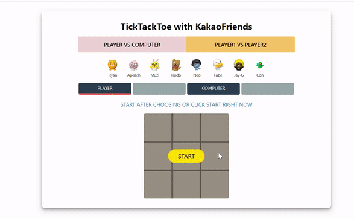
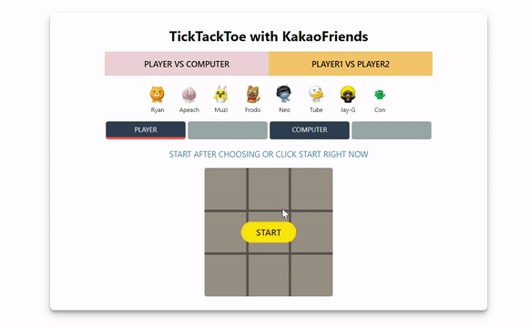
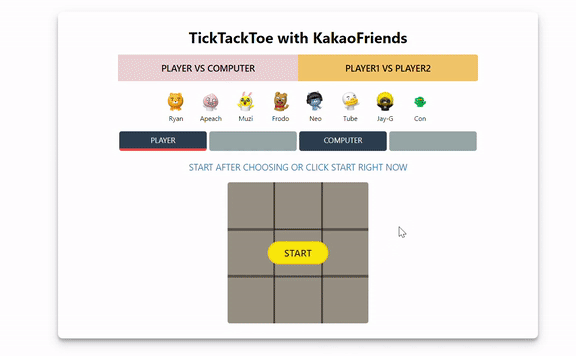
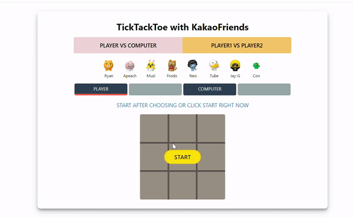

# TicTacToe 
> Play tictactoe with Kakaofriends

> [DEMO](https://jjanmo.github.io/jjanmo.github.io-kakao-tictactoe/)

## Preview
 
> 컴퓨터와의 대결(PvC)

 
> 2인용 게임(PvP)
 
 
> 캐릭터 선택을 하지 않고 시작하는 경우, 플레이어의 캐릭터가 랜덤으로 선택되어진다.
(컴퓨터의 캐릭터는 항상 랜덤이다.)

 
> 무승부

## Feature
- [x] 두가지 게임 타입 : PvP / PvC(Computer)
- [x] 플레이어별 캐릭터 선택 
- [x] 두가지 게임 결과 : 플레이어/컴퓨터 승리 or 무승부 
- [x] 턴에 따른 게임 진행
- [x] (빠른 진행을 위한) 캐릭터 랜덤 선택
- [x] 게임 시작과 게임 재시작 

## Challenge
- `이미지 스프라이트`를 사용할 때, 이미지와 화면의 크기에 따라서 달라지는 현상이 보였다. 그 원인은 이미지가 들어가는 영역이 크기에 따라서 달라지기 때문이었다.(아이템 정렬시 flex 사용) 이를 해결하기 위해서 캐릭터 이미지가 들어가는 영역을 `px`로 잡고 `항상 일정한 영역`을 가질 수 있게 만들어 주었다. 

- 코드를 어디까지 합쳐야하고 어디까지 분리해야하는지에 대한 기준이 명확하지않았다. 물론 이 부분은 많은 코드를 보고 분석하다 보면 얻어지는 것이라고 생각한다. 그럼에도 이 부분이 명쾌하지않아서 구현은 되지만 뭔가 찜찜한 기분이 든다.

- 항상 코딩을 할 때 가장 시간을 많이 잡아 먹는 부분은 변수명과 함수명을 어떻게 지어야 이름만 보고도 그 함수, 변수의 역할을 알 수 있을까에 대한 고민이다. 각각 기능에 따른 이름을 팍팍(?) 티나게 작명해야하는데 아직까지 그런 부분에서 부족함을 많이 느꼈다. 그리고 위에 말과 이어지는 포인트인 이유가 이름이 명쾌하지않으면 특정함수 안에 어디까지 구현해야할지에 대한 기준이 서지않는 것 같다.
 
## Improvement
- `Minimax algorithm` 에 대해서 알아보고 이를 적용하여 다시 컴퓨터의 수준에 따른 틱택토를 구현해보자
    > `Minimax algorithm` 은 장기나 오목, 체스등에서 컴퓨터가 어떤 수를 두어야하는지를 결정해주는 알고리즘이다. 게임외에도 AI분야에서 많이 응용되는 알고리즘이라고 한다.

- `미디어쿼리`를 적용하지 않았기 때문에 화면 크기에 따라서 캐릭터 리스트가 1줄 혹은 2줄 정렬이 된다. 이미지는 깨지지않아서 다행이지만 일관되게 1줄로 정렬이 되도록 맞추는 것이 바람직한 것으로 보인다. 

